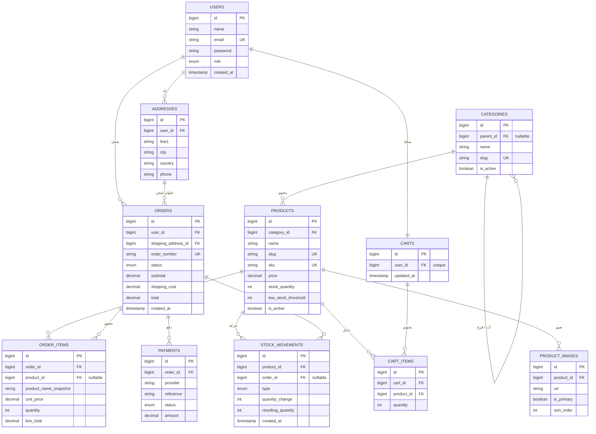
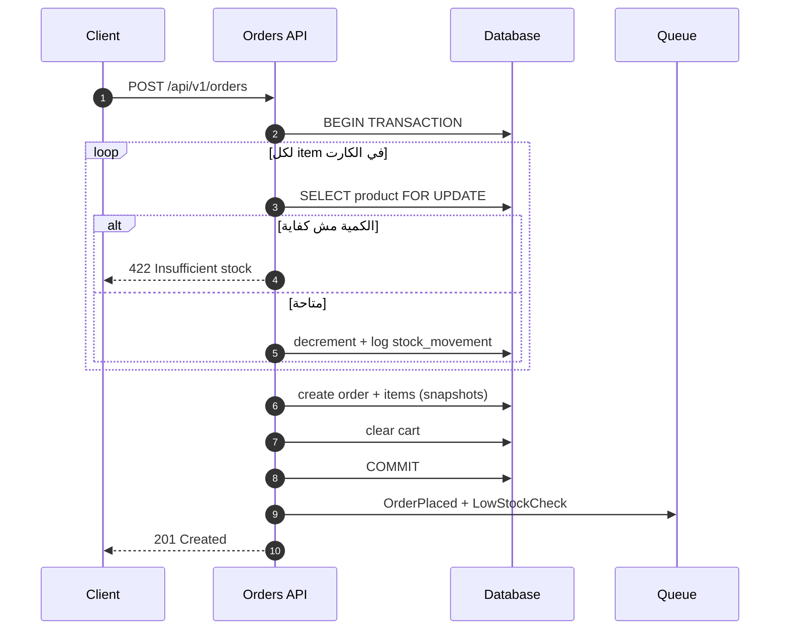

# 🛒 E-commerce Store API

> Backend RESTful API لمتجر إلكتروني — منتجات، أقسام، كارت، أوردرات، عملاء، وإدارة مخزون تمنع البيع الزائد.
> **API only** (من غير frontend) · مبني على **Laravel**.

الرسمة تحت بتتعرض **مرسومة تلقائيًا على GitHub** (GitHub بيدعم Mermaid داخل الـ Markdown).

---

## 📦 Tech Stack

| الطبقة | التقنية |
|--------|---------|
| Framework | Laravel 11+ |
| Auth | Laravel Sanctum (token-based) |
| Authorization | Policies + Gates — roles: `admin` / `customer` |
| Database | MySQL 8 / PostgreSQL |
| Cache / Locks / Queue | Redis |
| API | RESTful, versioned تحت `/api/v1` |
| Docs | OpenAPI (Swagger) |

---

## 🗂️ Data Model — ERD

---

## 🔗 العلاقات (Relationships)

| من | العلاقة | إلى | Foreign key | On delete |
|----|:-------:|-----|-------------|-----------|
| users | 1 — N | addresses | `addresses.user_id` | CASCADE |
| users | 1 — 1 | carts | `carts.user_id` (UK) | CASCADE |
| users | 1 — N | orders | `orders.user_id` | RESTRICT |
| addresses | 1 — N | orders | `orders.shipping_address_id` | RESTRICT |
| categories | 1 — N | categories | `categories.parent_id` (nullable) | SET NULL |
| categories | 1 — N | products | `products.category_id` | RESTRICT |
| products | 1 — N | product_images | `product_images.product_id` | CASCADE |
| products | 1 — N | cart_items | `cart_items.product_id` | CASCADE |
| products | 1 — N | order_items | `order_items.product_id` (nullable) | SET NULL |
| products | 1 — N | stock_movements | `stock_movements.product_id` | RESTRICT |
| carts | 1 — N | cart_items | `cart_items.cart_id` | CASCADE |
| orders | 1 — N | order_items | `order_items.order_id` | CASCADE |
| orders | 1 — N | payments | `payments.order_id` | CASCADE |
| orders | 1 — N | stock_movements | `stock_movements.order_id` (nullable) | SET NULL |

**قيود إضافية:** `cart_items` عليها unique على `(cart_id, product_id)` — نفس المنتج مايتكررش في الكارت.

---

## ⭐ أهم قرارات التصميم (للنقاش مع العميل)

- **إدارة المخزون:** الخصم من الكمية بيحصل **وقت تأكيد الأوردر** (مش وقت الإضافة للكارت)، جوه `DB::transaction` مع `lockForUpdate()` لمنع الـ **overselling** لو يوزرين طلبوا آخر قطعة في نفس اللحظة.
- **حالات المنتج:** `stock_quantity = 0` → out of stock · `stock_quantity ≤ low_stock_threshold` → محتاج reorder (يبعت alert للأدمن).
- **الإلغاء:** أوردر يتلغى قبل الشحن → ترجيع الكمية (restock) وتسجيل الحركة في `stock_movements`.
- **Snapshot:** `order_items` بتخزّن السعر والاسم وقت البيع — الأوردر القديم يفضل صحيح حتى لو المنتج اتغيّر أو اتشال.
- **الفلوس:** `decimal(10,2)` مش `float`.
- **Idempotency key** على `POST /api/v1/orders` لمنع الأوردر المكرر.
- **Soft delete:** المنتجات والأقسام بتتخفي بـ `is_active` بدل الحذف الفعلي.

---

## 🔀 Checkout Flow

---

## 📚 توثيق إضافي

| الملف | المحتوى |
|-------|---------|
| [docs/ecommerce_data_model_erd.html](docs/ecommerce_data_model_erd.html) | نسخة ERD تفاعلية — نزّلها وافتحها في المتصفح (GitHub بيعرض ملفات HTML كـ source) |

> 💡 الرسمة الأساسية للنقاش موجودة فوق مباشرة في الـ README — بترسمها GitHub تلقائيًا.

---

## 🗺️ Roadmap

1. **Setup + Auth** — Laravel + Sanctum + register / login / me
2. **Catalog** — Categories + Products CRUD + listing / فلترة
3. **Cart** — cart + cart items + soft stock check
4. **Checkout + Inventory** ⭐ — Orders + transaction/locking + stock_movements
5. **Admin** — إدارة المنتجات، low-stock، حالة الأوردرات
6. **Polish** — payments، events/queue، alerts، API docs، tests
