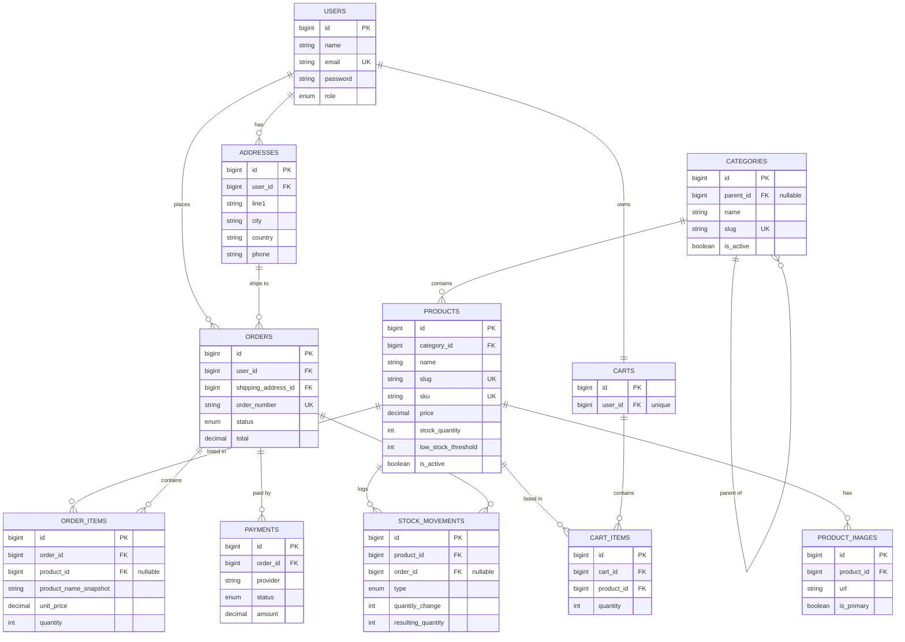
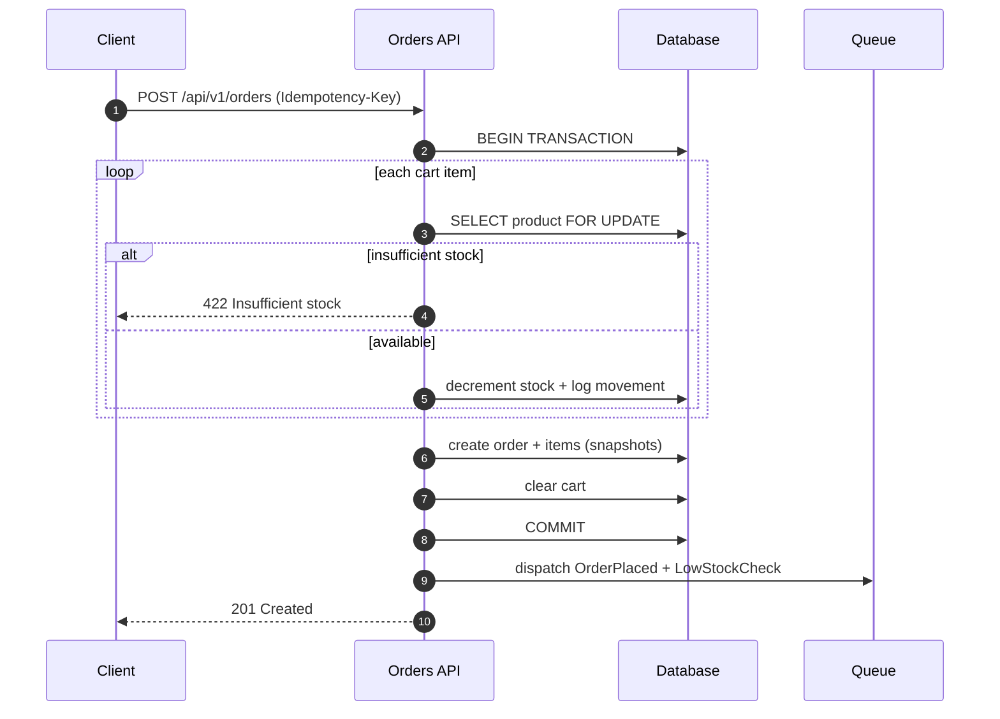

# 🛒 E-commerce Store API

A backend **RESTful API** for an e-commerce store — products, categories, shopping cart, orders, customers, and an inventory system that prevents overselling under concurrent load.

**API only** (no frontend) · Built with **Laravel**.


> The diagram below renders automatically on GitHub (native Mermaid support). This README is the entry point; deep-dive documents live in [`docs/`](docs/).

---

## 📖 Documentation

**Product & Design**
| # | Document | What's inside |
|---|----------|---------------|
| 01 | [Requirements Analysis](docs/01-requirements.md) | Functional & non-functional requirements, actors, use cases, business rules, scope |
| 02 | [Architecture](docs/02-architecture.md) | Architecture decision (MVC vs DDD vs Hexagonal), layers, folder structure, patterns, **code** |
| 03 | [Data Model](docs/03-data-model.md) | ERD, entities, relationships, keys, constraints, indexes |
| 04 | [API Reference](docs/04-api-reference.md) | Endpoints, auth, response envelope, pagination |
| 05 | [Inventory & Concurrency](docs/05-inventory-and-concurrency.md) | Stock model, no-overselling strategy, locking, **code** |
| 06 | [Implementation Plan](docs/06-implementation-plan.md) | Milestones, deliverables, testing strategy |

**Engineering Handbook** (how we build)
| # | Document | What's inside |
|---|----------|---------------|
| 07 | [Tech Stack & Code Style](docs/07-tech-stack-and-code-style.md) | Packages, PSR-12 style, design patterns, file layout |
| 08 | [Conventions & Scaffolding](docs/08-conventions-and-scaffolding.md) | Namespaces, naming, localization, **how to add a feature** |
| 09 | [Integrations](docs/09-integrations.md) | Payment gateway, media/storage, push, API docs |

An interactive version of the ERD (same 11-entity model) is available at [`docs/ecommerce_data_model_erd.html`](docs/ecommerce_data_model_erd.html) — download and open it in a browser.

---

## ✨ Core Features

- **Catalog** — hierarchical categories, products with images, search / filter / pagination.
- **Customers** — token-based authentication, profiles, shipping addresses, role-based access (`customer` / `admin`).
- **Cart** — one active cart per user; add, update, remove, clear items.
- **Checkout & Orders** — convert a cart into an order with price snapshots and a full status lifecycle.
- **Inventory** — atomic stock deduction, overselling protection, out-of-stock & reorder detection, full stock-movement audit trail.
- **Payments** — pluggable payment records ready to connect to a gateway.

---

## 🧰 Tech Stack

| Layer | Technology |
|-------|-----------|
| Language / Framework | PHP ^8.2 · Laravel ^11 |
| API Auth | Laravel Sanctum (bearer tokens) |
| Routing | Spatie Route Attributes (`#[Get]`, `#[Post]`) |
| Validation | WendellAdriel Validated DTOs |
| Responses | API Resources + `ApiResponse` envelope |
| Persistence | Eloquent + Repository pattern |
| Admin panel | Filament + Filament Shield (roles) |
| Database | MySQL 8 / PostgreSQL |
| Cache · Queue · Locks | Redis |
| Media / Storage | Spatie Media Library + S3 |
| API Docs | L5-Swagger (`/api/documentation`) |
| Quality | Pint (PSR-12) · PHPUnit · Telescope |

> Full engineering conventions: [07 · Tech Stack & Code Style](docs/07-tech-stack-and-code-style.md).

---

## 🏛️ Architecture at a Glance

This project uses a **Layered architecture** — the same stack as our other Laravel backends — rather than plain MVC or full Hexagonal. Business logic lives in **Services**, data access behind **Repositories**, request input is typed via **Validated DTOs**, and responses go through a unified **`ApiResponse`** envelope. Admin is a **Filament** panel, not API endpoints. See [Architecture](docs/02-architecture.md) for the full decision record.

```
HTTP Request
    │
    ▼
Route Attribute ─► Controller ─► Validated DTO (validation)
                       │
                       ▼
                    Service  ──►  Domain Events ──► Queue (async)
                       │
                       ▼
                    Repository ─► Eloquent Model ─► Database
                       │
                       ▼
                    API Resource ─► ApiResponse (JSON)
```

---

## 🗂️ Data Model (ERD)



Full breakdown, relationship table, and constraints: [Data Model](docs/03-data-model.md).

---

## ⭐ Key Design Decisions

| Decision | Choice |
|----------|--------|
| **Overselling protection** | Stock is decremented **at checkout**, inside a DB transaction with `SELECT … FOR UPDATE` (pessimistic locking) |
| **Price integrity** | `order_items` store a **snapshot** of price & name at purchase time |
| **Money** | `decimal(12,2)` with Eloquent decimal casts — never floats |
| **Idempotency** | Idempotency key on `POST /orders` to prevent duplicate orders |
| **Soft deletion** | Products & categories hidden via `is_active`, not hard-deleted |
| **Audit** | Every stock change recorded in `stock_movements` |

See [Inventory & Concurrency](docs/05-inventory-and-concurrency.md) for the deep dive.

---

## 🔀 Checkout Flow



---

## 🚀 Getting Started

> The application code is not implemented yet — the project is in the **design phase**. These are the intended setup steps.

```bash
# 1. Clone
git clone git@github.com:Ahmedibrahim1998/ecommerce-api.git
cd ecommerce-api

# 2. Install dependencies
composer install

# 3. Environment
cp .env.example .env
php artisan key:generate

# 4. Configure DB & Redis in .env, then migrate + seed
php artisan migrate --seed

# 5. Run
php artisan serve
```

- API base URL: `http://localhost:8000/api/v1`
- API docs (Swagger): `http://localhost:8000/api/documentation`
- Admin panel (Filament): `http://localhost:8000/admin`
- Lint & test: `composer lint` · `php artisan test`

---

## 🗺️ Roadmap

1. **Setup & Auth** — Laravel, Sanctum, register / login / me
2. **Catalog** — categories & products (CRUD, listing, filtering)
3. **Cart** — cart & cart items with soft stock checks
4. **Checkout & Inventory** ⭐ — orders, transactional locking, stock movements
5. **Admin** — product management, low-stock, order status
6. **Polish** — payments, events/queues, alerts, API docs, tests

Details: [Implementation Plan](docs/06-implementation-plan.md).

---

## 📄 License

To be defined with the client.
