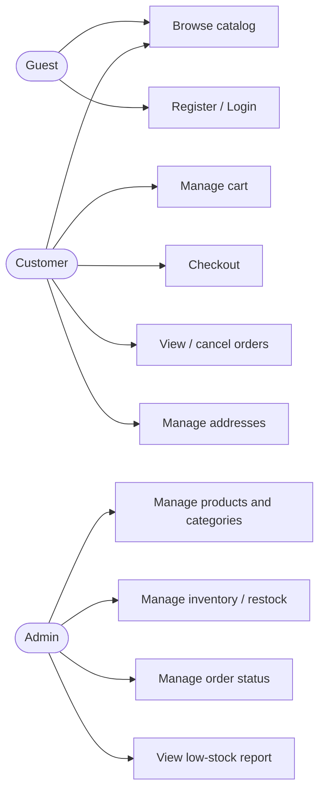
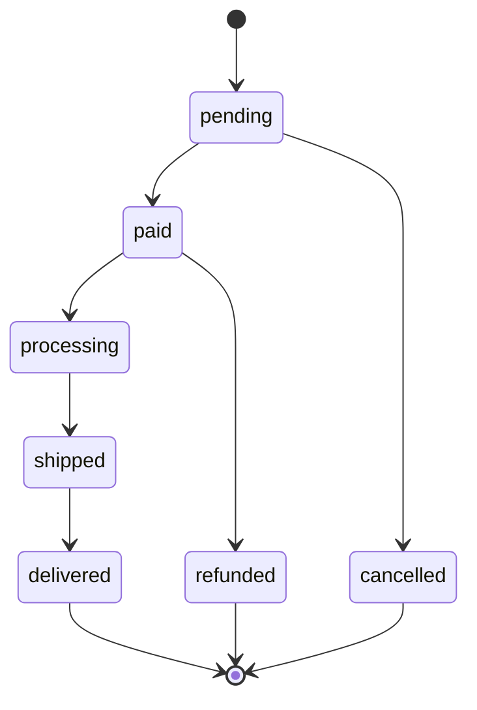

# 01 · Requirements Analysis

This document defines **what** the system must do (functional requirements), **how well** it must do it (non-functional requirements), who uses it, and the business rules that govern its behavior. It is the contract we validate with the client before implementation.

- [1. Actors & Roles](#1-actors--roles)
- [2. Functional Requirements](#2-functional-requirements)
- [3. Non-Functional Requirements](#3-non-functional-requirements)
- [4. Use Cases](#4-use-cases)
- [5. Business Rules](#5-business-rules)
- [6. Scope & Assumptions](#6-scope--assumptions)

---

## 1. Actors & Roles

| Actor | Description | Access |
|-------|-------------|--------|
| **Guest** | Unauthenticated visitor | Browse catalog, register, log in |
| **Customer** | Authenticated end user | Everything a guest can do + cart, checkout, orders, addresses |
| **Admin** | Store operator | Manage catalog, inventory, and orders; view reports |

Roles are stored on `users.role` and enforced through Laravel **Policies** and route middleware.

---

## 2. Functional Requirements

### FR-1 · Authentication & Accounts
- FR-1.1 A guest can register with name, email, and password.
- FR-1.2 A user can log in and receive a bearer token (Sanctum).
- FR-1.3 A user can log out (revoke the current token).
- FR-1.4 A user can view and update their own profile.
- FR-1.5 A customer can manage multiple shipping addresses (CRUD).

### FR-2 · Catalog (Categories & Products)
- FR-2.1 Anyone can browse active categories, including nested subcategories.
- FR-2.2 Anyone can list products with **pagination, search, sorting, and filtering** (by category, price range, availability).
- FR-2.3 Anyone can view a single product with its images and stock availability.
- FR-2.4 An admin can create, update, and deactivate categories.
- FR-2.5 An admin can create, update, and deactivate products, including images and pricing.

### FR-3 · Shopping Cart
- FR-3.1 A customer has exactly **one active cart**.
- FR-3.2 A customer can add a product to the cart with a quantity.
- FR-3.3 A customer can update the quantity of a cart item.
- FR-3.4 A customer can remove an item or clear the whole cart.
- FR-3.5 Adding/updating validates that the requested quantity is currently available (soft check — no reservation).

### FR-4 · Checkout & Orders
- FR-4.1 A customer can convert their cart into an order (checkout) by choosing a shipping address.
- FR-4.2 Checkout validates stock and **deducts it atomically** (see [Inventory](05-inventory-and-concurrency.md)).
- FR-4.3 Each order line stores a **snapshot** of product name and unit price.
- FR-4.4 A customer can list their orders and view a single order.
- FR-4.5 A customer can cancel an order while it is still cancellable; cancellation **restocks** the items.
- FR-4.6 An admin can update an order's status through its lifecycle.

### FR-5 · Inventory Management
- FR-5.1 Every stock change is recorded as a **stock movement** (`sale`, `restock`, `adjustment`, `cancel`).
- FR-5.2 A product with `stock_quantity = 0` is flagged **out of stock** and cannot be ordered.
- FR-5.3 A product at or below its `low_stock_threshold` is flagged **needs reorder** and raises an alert to admins.
- FR-5.4 An admin can manually restock or adjust a product's quantity.
- FR-5.5 An admin can list products that need reordering.

### FR-6 · Payments
- FR-6.1 An order can have one or more payment attempts, each with a provider, reference, status, and amount.
- FR-6.2 The payment layer is abstracted so a real gateway can be plugged in later without changing order logic.

---

## 3. Non-Functional Requirements

| # | Category | Requirement |
|---|----------|-------------|
| NFR-1 | **Data integrity** | No overselling: concurrent checkouts of the last unit must never both succeed. Enforced by DB transactions + row locking. |
| NFR-2 | **Reliability** | Order creation is idempotent (Idempotency-Key) to survive client retries. |
| NFR-3 | **Security** | Token auth, role-based authorization, request validation, mass-assignment protection, rate limiting, HTTPS-only in production. |
| NFR-4 | **Performance** | All list endpoints paginated; hot queries indexed; catalog reads cacheable. Target p95 < 300 ms for read endpoints. |
| NFR-5 | **Scalability** | Stateless API (horizontally scalable); heavy/slow work (emails, alerts) offloaded to queues. |
| NFR-6 | **Maintainability** | Layered architecture, dependency inversion via interfaces, ≥ 80% coverage on domain logic. |
| NFR-7 | **Observability** | Structured logging, an auditable stock-movement trail, and consistent error reporting. |
| NFR-8 | **API standards** | Versioned (`/api/v1`), RESTful resources, consistent JSON envelope and error format, OpenAPI documentation. |
| NFR-9 | **Money correctness** | All monetary values use fixed-precision decimals via a `Money` value object — never floating point. |

---

## 4. Use Cases

### Primary use case: **Checkout** (UC-Checkout)

| | |
|---|---|
| **Actor** | Customer |
| **Precondition** | Authenticated; cart has at least one item; a shipping address exists |
| **Main flow** | 1. Customer submits checkout with an address and an Idempotency-Key. 2. System opens a transaction and locks each product row. 3. System verifies stock for every line. 4. System deducts stock and logs a movement per line. 5. System creates the order with price snapshots. 6. System clears the cart and commits. 7. System returns the created order. |
| **Alternate flow** | 3a. If any line lacks stock → rollback, return `422` naming the product. |
| **Postcondition** | Order created, stock reduced, movements logged, cart empty, async events dispatched |

---

## 5. Business Rules

| # | Rule |
|---|------|
| BR-1 | Stock is deducted **at order creation**, not when added to the cart. |
| BR-2 | A cart item quantity may never exceed the product's available stock at checkout time. |
| BR-3 | Order line price is captured at purchase time and never changes afterward, even if the product's price changes. |
| BR-4 | A product cannot be permanently deleted while it is referenced by orders; it is deactivated instead. |
| BR-5 | Cancelling a non-shipped order returns its quantities to stock. |
| BR-6 | Order status transitions are one-directional: `pending → paid → processing → shipped → delivered`, with `cancelled` / `refunded` as terminal branches. |
| BR-7 | A category cannot be deleted while it contains products. |
| BR-8 | Each `(cart_id, product_id)` pair is unique — the same product is a single line with a quantity, never duplicated. |

### Order status lifecycle

---

## 6. Scope & Assumptions

### In scope (v1)
- Single currency (configurable, default from `.env`).
- Registered-user cart & checkout only — **no guest checkout**.
- Single logical inventory pool per product (no multi-warehouse).
- Stock deduction via pessimistic locking at checkout.

### Out of scope (v1) — candidates for later
- Timed stock **reservation** with expiry (locking at checkout is sufficient for expected load).
- Coupons / discounts / promotions.
- Product reviews & ratings, wishlists.
- Multi-warehouse / multi-currency.
- Real payment-gateway integration (the data model is ready; the integration is a later milestone).

### Assumptions
- Clients communicate over HTTPS and send/accept JSON.
- One primary relational database; Redis available for cache/queue/locks.
- Product images are stored via URLs (object storage / CDN); the API stores references, not binaries.

---

**Next:** [02 · Architecture →](02-architecture.md)
