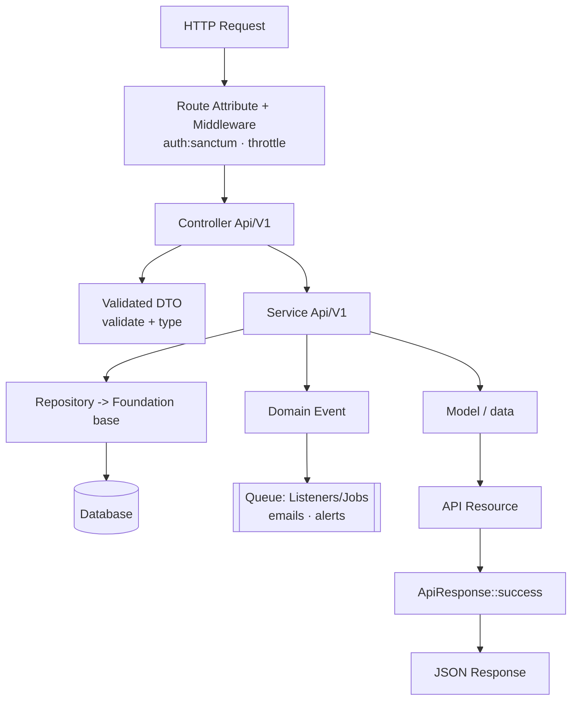

# 02 · Architecture

This is the **Architecture Decision Record**. It documents the architectural style, why the alternatives were rejected, how the layers map onto our team's established stack, and shows representative code in the house style.

> This project follows the **same conventions as our existing Laravel backends**. Read this together with [07 · Tech Stack & Code Style](07-tech-stack-and-code-style.md) and [08 · Conventions & Scaffolding](08-conventions-and-scaffolding.md).

- [1. The Decision](#1-the-decision)
- [2. Why Not Plain MVC / Full DDD / Hexagonal](#2-why-not-plain-mvc--full-ddd--hexagonal)
- [3. The Layers](#3-the-layers)
- [4. Request Lifecycle](#4-request-lifecycle)
- [5. Folder Structure](#5-folder-structure)
- [6. Code by Layer](#6-code-by-layer)
- [7. Admin: Filament, not API](#7-admin-filament-not-api)
- [8. Design Patterns Used](#8-design-patterns-used)
- [9. Testing Strategy](#9-testing-strategy)

---

## 1. The Decision

> **We use a Layered architecture — Controller → DTO → Service → Repository → Model — with attribute-based routing, a unified `ApiResponse` envelope, API Resources, and backed Enums. Admin is a Filament panel. This is our team's standard stack, applied consistently.**

Rationale:

- **Consistency with existing projects.** New developers already know this layout (routing attributes, DTOs, `Foundation\Repositories\Repository`, `ApiResponse`), so onboarding is instant and code review is uniform.
- **Business logic is isolated and testable.** Rules live in Services, not controllers; controllers only translate HTTP ↔ service calls.
- **Persistence is abstracted.** Repositories extend a shared `Foundation` base and are bound by interface in `RepositoryServiceProvider`, so services depend on contracts, not Eloquent.
- **Validation is typed.** Request data enters through Validated DTOs, giving typed properties and validation before the controller body runs.
- **Admin is free.** Filament + Filament Shield gives the store operators a full admin panel (roles/permissions) without hand-building admin endpoints.

---

## 2. Why Not Plain MVC / Full DDD / Hexagonal

| Style | What it is | Verdict |
|-------|-----------|---------|
| **Plain MVC** | Logic in controllers/models | ❌ Fat controllers, duplicated rules, untestable. Checkout (transaction + locking + snapshots + events) cannot live in a controller. |
| **Full DDD** | Aggregates decoupled from the ORM, mapping layer, repositories per aggregate | ⚠️ Great for very complex domains, but the ORM-decoupling overhead doesn't pay off here. We keep its useful tactical pieces: backed **enums** for state and **domain events** for side effects. |
| **Hexagonal / Ports & Adapters** | Domain core isolated behind ports | ⚠️ Overkill — Laravel is a deliberate long-term choice, not something to abstract away. We keep only the useful idea: depend on **interfaces** for persistence and third parties (payments). |
| **Layered (our stack)** ✅ | Controller → DTO → Service → Repository → Model | ✅ **Chosen.** Matches our other backends, balances clarity, testability, and delivery speed. |

**Guiding principle:** *Depend on abstractions for things that cross a boundary (repositories, payment gateways); use the framework directly for everything else.*

---

## 3. The Layers

| Layer | Namespace | Responsibility |
|-------|-----------|----------------|
| **Routing** | attributes on controllers | Spatie Route Attributes (`#[Get]`, `#[Post]`) map URIs + middleware |
| **Controller** | `App\Http\Controllers\Api\V1\{Feature}` | Translate HTTP ↔ service; return `ApiResponse` with a Resource |
| **DTO** | `App\Http\DTOs\Api\V1\{Feature}` | Validate & type incoming request data |
| **Service** | `App\Services\Api\V1\{Feature}` | Orchestrate a use case: business rules, transactions, events |
| **Repository** | `App\Repositories\{Entity}` | Persistence & queries behind an interface (extends `Foundation` base) |
| **Model** | `App\Models` | Eloquent mapping, relations, casts, scopes |
| **Resource** | `App\Http\Resources\Api\V1` | Shape the JSON payload (snake_case keys) |
| **ApiResponse** | `App\Foundation\Api\Http\Response\ApiResponse` | Unified success/error envelope |
| **Enum** | `App\Enum\{Domain}` | Backed enums for state (`OrderStatusEnum`, ...) |
| **Exception** | `App\Exceptions\{Domain}` | Domain errors thrown from services |
| **Event / Listener / Job** | `App\Events`, `App\Listeners`, `App\Jobs` | Async side effects on the queue |
| **Policy** | `App\Policies` | Authorization per model |
| **Admin** | `App\Filament` | Filament panel for operators (not API) |

---

## 4. Request Lifecycle



---

## 5. Folder Structure

Flat, layer-first layout — identical in spirit to our other backends.

```
app/
├── Enum/                         # OrderStatusEnum, RoleEnum, StockMovementTypeEnum, ...
│   ├── Order/
│   ├── Product/
│   └── User/
├── Events/                       # OrderPlaced, ProductLowStock, OrderCancelled
├── Exceptions/                   # Order/InsufficientStockException, Cart/EmptyCartException
│   ├── Cart/
│   └── Order/
├── Filament/                     # Admin panel (Resources, Pages, Widgets)
├── Foundation/                   # ApiResponse, Repositories\Repository (base), Enum base
├── Http/
│   ├── Controllers/Api/V1/       # CatalogController, CartController, OrderController, ...
│   ├── DTOs/Api/V1/              # AddCartItemDTO, CheckoutDTO, ...
│   ├── Middleware/Api/           # API middleware (e.g. ForceJsonResponse)
│   └── Resources/Api/V1/         # ProductResource, OrderResource, ...
├── Jobs/                         # queued work
├── Listeners/                    # NotifyAdminsOfLowStock, ...
├── Models/                       # User, Category, Product, Cart, Order, ... (+ sub-namespaces)
├── Notifications/                # LowStockNotification, OrderPlacedNotification
├── Policies/                     # ProductPolicy, OrderPolicy
├── Providers/                    # RepositoryServiceProvider (interface -> impl bindings)
├── Repositories/                 # Product/, Cart/, Order/ (interface + impl per entity)
│   ├── Cart/
│   ├── Order/
│   └── Product/
└── Services/
    ├── Api/V1/                   # Catalog/, Cart/, Order/ (CheckoutService, ...)
    └── ThirdParties/             # Payment gateway adapters
lang/
└── en/  (enum.php, order.php, cart.php, validation.php)
```

---

## 6. Code by Layer

All examples serve one use case — **checkout** — so the layers are visible together.

### 6.1 Controller with attribute routing — `OrderController`

```php
namespace App\Http\Controllers\Api\V1;

use App\Foundation\Api\Http\Response\ApiResponse;
use App\Http\DTOs\Api\V1\Order\CheckoutDTO;
use App\Http\Resources\Api\V1\OrderResource;
use App\Services\Api\V1\Order\CheckoutService;
use Spatie\RouteAttributes\Attributes\{Get, Post};

final class OrderController extends Controller
{
    public function __construct(private readonly CheckoutService $checkout) {}

    #[Post(uri: 'orders', middleware: ['auth:sanctum', 'throttle:checkout'])]
    public function store(CheckoutDTO $dto): \Illuminate\Http\JsonResponse
    {
        $order = $this->checkout->place(auth()->user(), $dto);

        return ApiResponse::success(
            data: new OrderResource($order),
            message: trans('order.api.placed_successfully'),
            code: 201,
        );
    }

    #[Get(uri: 'orders', middleware: ['auth:sanctum'])]
    public function index(): \Illuminate\Http\JsonResponse
    {
        return ApiResponse::success(
            data: OrderResource::collection($this->checkout->listForUser(auth()->user())),
        );
    }
}
```

### 6.2 Validated DTO — `CheckoutDTO`

```php
namespace App\Http\DTOs\Api\V1\Order;

use WendellAdriel\ValidatedDTO\ValidatedDTO;
use WendellAdriel\ValidatedDTO\Attributes\Rules;

final class CheckoutDTO extends ValidatedDTO
{
    #[Rules(['required', 'integer', 'exists:addresses,id'])]
    public int $shipping_address_id;

    protected function defaults(): array { return []; }
    protected function casts(): array { return []; }
}
```

### 6.3 Service — `CheckoutService` (the core)

```php
namespace App\Services\Api\V1\Order;

use App\Enum\Order\OrderStatusEnum;
use App\Events\OrderPlaced;
use App\Exceptions\Cart\EmptyCartException;
use App\Models\Order;
use App\Repositories\Cart\CartRepositoryInterface;
use App\Services\Api\V1\Inventory\InventoryService;
use Illuminate\Support\Facades\DB;

final readonly class CheckoutService
{
    public function __construct(
        private CartRepositoryInterface $carts,
        private InventoryService $inventory,
    ) {}

    public function place(\App\Models\User $user, \App\Http\DTOs\Api\V1\Order\CheckoutDTO $dto): Order
    {
        $cart = $this->carts->activeForUser($user->id);

        if ($cart->items->isEmpty()) {
            throw new EmptyCartException();
        }

        return DB::transaction(function () use ($cart, $user, $dto) {
            $order = Order::create([
                'user_id'             => $user->id,
                'shipping_address_id' => $dto->shipping_address_id,
                'order_number'        => \App\Support\OrderNumber::generate(),
                'status'              => OrderStatusEnum::PENDING,
            ]);

            foreach ($cart->items as $item) {
                // Locks the product row until the transaction commits.
                $this->inventory->deductForSale($item->product_id, $item->quantity, $order->id);

                $product = $item->product;
                $order->items()->create([
                    'product_id'            => $product->id,
                    'product_name_snapshot' => $product->name,
                    'unit_price'            => $product->price,   // snapshot
                    'quantity'              => $item->quantity,
                    'line_total'            => $product->price * $item->quantity,
                ]);
            }

            $order->recalculateTotals();
            $this->carts->clear($cart);

            event(new OrderPlaced($order));   // queued listeners: email + low-stock check

            return $order->fresh('items');
        });
    }
}
```

### 6.4 Repository (interface + implementation over Foundation base)

```php
namespace App\Repositories\Product;

use App\Foundation\Repositories\RepositoryInterface;

interface ProductRepositoryInterface extends RepositoryInterface
{
    public function lockById(int $id): \App\Models\Product;   // SELECT ... FOR UPDATE
    public function lowStock(): \Illuminate\Support\Collection;
}
```

```php
namespace App\Repositories\Product;

use App\Foundation\Repositories\Repository;
use App\Models\Product;

final class ProductRepository extends Repository implements ProductRepositoryInterface
{
    public function __construct() { parent::__construct(new Product); }

    public function lockById(int $id): Product
    {
        return $this->model->newQuery()->lockForUpdate()->findOrFail($id);
    }

    public function lowStock(): \Illuminate\Support\Collection
    {
        return $this->model->newQuery()
            ->whereColumn('stock_quantity', '<=', 'low_stock_threshold')
            ->get();
    }
}
```

Bound by interface in `App\Providers\RepositoryServiceProvider`:

```php
protected array $repositories = [
    ProductRepositoryInterface::class => ProductRepository::class,
    CartRepositoryInterface::class    => CartRepository::class,
    OrderRepositoryInterface::class   => OrderRepository::class,
];
```

### 6.5 Enum — `OrderStatusEnum`

```php
namespace App\Enum\Order;

use App\Foundation\Enum\BasicEnum;
use Filament\Support\Contracts\HasLabel;

enum OrderStatusEnum: string implements HasLabel
{
    case PENDING    = 'pending';
    case PAID       = 'paid';
    case PROCESSING = 'processing';
    case SHIPPED    = 'shipped';
    case DELIVERED  = 'delivered';
    case CANCELLED  = 'cancelled';
    case REFUNDED   = 'refunded';

    public function getLabel(): string
    {
        return trans("enum.order_status.{$this->value}");
    }
}
```

### 6.6 API Resource — `OrderResource` (snake_case keys)

```php
namespace App\Http\Resources\Api\V1;

use Illuminate\Http\Resources\Json\JsonResource;

final class OrderResource extends JsonResource
{
    public function toArray($request): array
    {
        return [
            'id'           => $this->id,
            'order_number' => $this->order_number,
            'status'       => $this->status->value,
            'status_label' => $this->status->getLabel(),
            'total'        => $this->total,
            'items'        => OrderItemResource::collection($this->whenLoaded('items')),
            'created_at'   => $this->created_at?->toIso8601String(),
        ];
    }
}
```

### 6.7 Exception, Event + queued Listener

```php
namespace App\Exceptions\Order;

final class InsufficientStockException extends \Exception
{
    public function __construct(public readonly int $productId, public readonly int $available)
    {
        parent::__construct(trans('order.api.insufficient_stock'));
    }
}
```

```php
final class NotifyAdminsOfLowStock implements \Illuminate\Contracts\Queue\ShouldQueue
{
    public function handle(\App\Events\ProductLowStock $event): void
    {
        $product = \App\Models\Product::find($event->productId);
        \Illuminate\Support\Facades\Notification::send(
            \App\Models\User::admins()->get(),
            new \App\Notifications\LowStockNotification($product),
        );
    }
}
```

---

## 7. Admin: Filament, not API

Store operators use a **Filament** admin panel, not hand-built API endpoints:

- **Filament Resources** for `Product`, `Category`, `Order`, `StockMovement` (list, create, edit, view).
- **Filament Shield** for roles & permissions (`admin` and any finer-grained roles).
- **Order status transitions**, **restock**, and **low-stock views** are Filament actions/widgets backed by the same Services (`InventoryService`, order services) the API uses — one source of truth for business logic.

The public API (`/api/v1`) therefore stays focused on the **customer-facing app**. See [04 · API Reference](04-api-reference.md).

---

## 8. Design Patterns Used

| Pattern | Where | Why |
|---------|-------|-----|
| **Service** | `App\Services\Api\V1\*` | One class per use case; the transaction boundary |
| **Repository** | `App\Repositories\{Entity}` over `Foundation\Repositories\Repository` | Swap/mock persistence; DB-agnostic services |
| **DTO (validated)** | `App\Http\DTOs\Api\V1\*` | Typed, pre-validated request input |
| **Response envelope** | `Foundation\...\ApiResponse` | One consistent success/error shape |
| **Domain Events + Queue** | `OrderPlaced`, `ProductLowStock` | Decouple side effects; fast requests |
| **Backed Enums** | `OrderStatusEnum`, `RoleEnum` | Type-safe state + human-readable labels |
| **Policy** | `App\Policies\*` | Centralized authorization |
| **Dependency Injection** | constructors | Inversion of control; testability |

---

## 9. Testing Strategy

| Level | Target | Tooling |
|-------|--------|---------|
| **Unit** | Services (mocked repos), enums, policies | PHPUnit |
| **Feature** | Endpoints end-to-end (HTTP → DB) | PHPUnit + `RefreshDatabase` |
| **Concurrency** | Overselling: two parallel checkouts for the last unit | PHPUnit, DB-backed |
| **Style / lint** | PSR-12 | `composer lint` (Pint) |

> The **concurrency test for overselling is mandatory** — the single most important correctness guarantee. See [05 · Inventory & Concurrency](05-inventory-and-concurrency.md).

---

**Previous:** [← 01 · Requirements](01-requirements.md) · **Next:** [03 · Data Model →](03-data-model.md)
