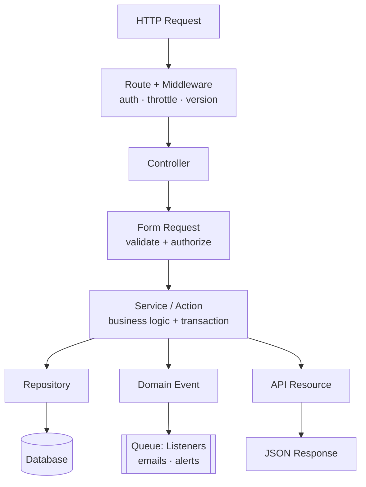

# 02 · Architecture

This document is the **Architecture Decision Record**. It explains which architectural style we chose, why we rejected the alternatives, how the layers are organized, and shows representative code for each layer.

- [1. The Decision](#1-the-decision)
- [2. Why Not Plain MVC / Full DDD / Hexagonal](#2-why-not-plain-mvc--full-ddd--hexagonal)
- [3. The Layers](#3-the-layers)
- [4. Request Lifecycle](#4-request-lifecycle)
- [5. Folder Structure](#5-folder-structure)
- [6. Code by Layer](#6-code-by-layer)
- [7. Design Patterns Used](#7-design-patterns-used)
- [8. Testing Strategy](#8-testing-strategy)

---

## 1. The Decision

> **We use a Modular, Layered architecture with a Service/Action layer and the Repository pattern, borrowing DDD *tactical* patterns (value objects, domain events) where they add value — all inside a single modular monolith.**

Rationale:

- **Laravel-idiomatic.** It builds on framework conventions (Eloquent, Form Requests, Resources, Events, Policies) instead of fighting them, so onboarding and hiring stay easy.
- **Business logic is testable and reusable.** Rules live in Services/Actions, not controllers, so they can be unit-tested and called from HTTP, queue jobs, or Artisan commands alike.
- **Data access is swappable.** Repositories hide Eloquent behind interfaces, which keeps services focused on business rules and makes them easy to mock.
- **Right-sized.** It gives us the boundaries and testability benefits of DDD/Hexagonal without their ceremony, which for a store of this size would slow delivery without a payoff.
- **Modular by domain.** Code is grouped by business capability (Catalog, Cart, Ordering, Inventory, Identity), so the system can later be split into services if it ever needs to be — the seams are already there.

---

## 2. Why Not Plain MVC / Full DDD / Hexagonal

| Style | What it is | Verdict for this project |
|-------|-----------|--------------------------|
| **Plain MVC** | Logic in controllers/models | ❌ "Fat controllers" become untestable and duplicate rules across endpoints. The checkout logic alone (transaction + locking + snapshots + events) would not fit cleanly in a controller. |
| **Full DDD** | Aggregates, entities/VOs decoupled from ORM, repositories per aggregate, mapping layer | ⚠️ Excellent for complex domains, but the ORM-decoupling and mapping overhead is high. We adopt its *tactical* pieces (value objects, domain events, ubiquitous language) without the full mapping cost. |
| **Hexagonal / Ports & Adapters** | Domain core isolated behind ports; framework is an adapter | ⚠️ Great for framework-agnostic cores and many external integrations. Overkill here — Laravel is a deliberate long-term choice, not something we need to abstract away. We keep just the useful idea: depend on interfaces for external concerns (payments, repositories). |
| **Modular Layered + DDD-lite** ✅ | Layers (Controller → Service → Repository → Model) grouped into domain modules, with VOs and domain events | ✅ **Chosen.** Best balance of clarity, testability, delivery speed, and future optionality. |

**Guiding principle:** *Depend on abstractions for things that cross a boundary (persistence, payment gateways); use the framework directly for things that don't.*

---

## 3. The Layers

| Layer | Responsibility | Must NOT |
|-------|----------------|----------|
| **Routing** | Map URLs to controllers, apply middleware (auth, throttle, version) | Contain logic |
| **Controller** | Translate HTTP ↔ application; call one service; return a Resource | Contain business rules or DB queries |
| **Form Request** | Validate & authorize input | Mutate data |
| **Service / Action** | Orchestrate a use case: business rules, transactions, events | Know about HTTP or JSON shape |
| **Repository** | Encapsulate persistence and queries behind an interface | Contain business rules |
| **Model (Eloquent)** | Persistence mapping, relationships, casts, scopes | Contain use-case orchestration |
| **API Resource** | Shape the JSON response | Contain business rules |
| **Value Object** | Model a typed concept (`Money`, `Sku`) with its invariants | Depend on the framework |
| **Event / Listener** | Decouple side effects (emails, alerts) via the queue | Block the request |
| **Policy** | Authorization decisions per resource | — |

---

## 4. Request Lifecycle



---

## 5. Folder Structure

A **module-per-domain** layout. Each module owns its models, services, repositories, and DTOs; HTTP concerns are grouped separately and versioned.

```
app/
├── Domain/                        # Business capabilities (the heart of the system)
│   ├── Identity/                  # users, addresses, auth
│   │   ├── Models/
│   │   ├── Services/
│   │   └── Repositories/
│   ├── Catalog/                   # categories, products, images
│   │   ├── Models/
│   │   ├── Services/
│   │   ├── Repositories/
│   │   └── Data/                  # DTOs
│   ├── Cart/
│   ├── Ordering/                  # orders, order items, payments, checkout
│   └── Inventory/                 # stock movements, stock service
│
├── Http/
│   └── Api/
│       └── V1/
│           ├── Controllers/
│           ├── Requests/
│           └── Resources/
│
├── Support/
│   └── ValueObjects/              # Money, Sku, ...
│
├── Events/                        # OrderPlaced, ProductLowStock, OrderCancelled
├── Listeners/
├── Policies/
└── Providers/                     # bind interfaces -> implementations
```

> **Starting simpler is fine.** A small team can begin with `app/Services` + `app/Repositories` in the default Laravel layout and graduate to the modular structure above as domains grow. The layer *responsibilities* stay identical either way.

---

## 6. Code by Layer

The examples below all serve one use case — **checkout** — so you can see the layers cooperate.

### 6.1 Routes — `routes/api.php`

```php
Route::prefix('v1')->group(function () {
    // Public
    Route::get('products', [ProductController::class, 'index']);
    Route::get('products/{product:slug}', [ProductController::class, 'show']);

    // Authenticated customer
    Route::middleware('auth:sanctum')->group(function () {
        Route::apiResource('cart.items', CartItemController::class)->shallow();
        Route::post('orders', [OrderController::class, 'store'])
            ->middleware('throttle:checkout');
        Route::get('orders', [OrderController::class, 'index']);
        Route::get('orders/{order}', [OrderController::class, 'show']);
        Route::post('orders/{order}/cancel', [OrderController::class, 'cancel']);
    });

    // Admin
    Route::middleware(['auth:sanctum', 'can:admin'])->prefix('admin')->group(function () {
        Route::apiResource('products', AdminProductController::class);
        Route::get('products/low-stock', [AdminProductController::class, 'lowStock']);
    });
});
```

### 6.2 Controller (thin) — `OrderController`

```php
final class OrderController extends Controller
{
    public function __construct(private readonly CheckoutService $checkout) {}

    public function store(StoreOrderRequest $request): JsonResponse
    {
        $order = $this->checkout->place(
            user: $request->user(),
            addressId: $request->integer('shipping_address_id'),
            idempotencyKey: $request->header('Idempotency-Key'),
        );

        return OrderResource::make($order)
            ->response()
            ->setStatusCode(201);
    }
}
```

### 6.3 Form Request — `StoreOrderRequest`

```php
final class StoreOrderRequest extends FormRequest
{
    public function authorize(): bool
    {
        return $this->user() !== null;
    }

    public function rules(): array
    {
        return [
            'shipping_address_id' => [
                'required', 'integer',
                Rule::exists('addresses', 'id')->where('user_id', $this->user()->id),
            ],
        ];
    }
}
```

### 6.4 Service / Action — `CheckoutService` (the core)

```php
final class CheckoutService
{
    public function __construct(
        private readonly CartRepositoryInterface $carts,
        private readonly InventoryService $inventory,
    ) {}

    public function place(User $user, int $addressId, ?string $idempotencyKey): Order
    {
        $cart = $this->carts->activeForUser($user->id);

        if ($cart->items->isEmpty()) {
            throw new EmptyCartException();
        }

        return DB::transaction(function () use ($cart, $user, $addressId) {
            $order = Order::create([
                'user_id'             => $user->id,
                'shipping_address_id' => $addressId,
                'order_number'        => OrderNumber::generate(),
                'status'              => OrderStatus::Pending,
            ]);

            foreach ($cart->items as $item) {
                // Locks the product row until the transaction commits.
                $this->inventory->deductForSale($item->product_id, $item->quantity, $order->id);

                $product = $item->product;
                $order->items()->create([
                    'product_id'            => $product->id,
                    'product_name_snapshot' => $product->name,
                    'unit_price'            => $product->price,      // snapshot
                    'quantity'              => $item->quantity,
                    'line_total'            => $product->price * $item->quantity,
                ]);
            }

            $order->recalculateTotals();
            $this->carts->clear($cart);

            event(new OrderPlaced($order));   // async listeners: email, low-stock check

            return $order->fresh('items');
        });
    }
}
```

### 6.5 Repository (interface + binding)

```php
interface ProductRepositoryInterface
{
    public function lockById(int $id): Product;   // SELECT ... FOR UPDATE
    public function lowStock(): Collection;
}

final class EloquentProductRepository implements ProductRepositoryInterface
{
    public function lockById(int $id): Product
    {
        return Product::query()->lockForUpdate()->findOrFail($id);
    }

    public function lowStock(): Collection
    {
        return Product::query()
            ->whereColumn('stock_quantity', '<=', 'low_stock_threshold')
            ->get();
    }
}
```

Bound in a service provider so services depend on the **interface**, not Eloquent:

```php
// AppServiceProvider::register()
$this->app->bind(ProductRepositoryInterface::class, EloquentProductRepository::class);
```

### 6.6 Value Object — `Money`

```php
final readonly class Money
{
    public function __construct(public int $minorUnits, public string $currency = 'USD')
    {
        if ($minorUnits < 0) {
            throw new InvalidArgumentException('Money cannot be negative.');
        }
    }

    public static function fromDecimal(string $amount, string $currency = 'USD'): self
    {
        return new self((int) bcmul($amount, '100'), $currency);
    }

    public function add(Money $other): self
    {
        $this->assertSameCurrency($other);
        return new self($this->minorUnits + $other->minorUnits, $this->currency);
    }

    public function multiply(int $qty): self
    {
        return new self($this->minorUnits * $qty, $this->currency);
    }

    private function assertSameCurrency(Money $other): void
    {
        if ($this->currency !== $other->currency) {
            throw new CurrencyMismatchException();
        }
    }
}
```

### 6.7 API Resource — `OrderResource`

```php
final class OrderResource extends JsonResource
{
    public function toArray(Request $request): array
    {
        return [
            'id'           => $this->id,
            'order_number' => $this->order_number,
            'status'       => $this->status->value,
            'total'        => $this->total,
            'items'        => OrderItemResource::collection($this->whenLoaded('items')),
            'created_at'   => $this->created_at->toIso8601String(),
        ];
    }
}
```

### 6.8 Event + Listener (async)

```php
final class ProductLowStock
{
    public function __construct(public readonly int $productId) {}
}

final class NotifyAdminsOfLowStock implements ShouldQueue
{
    public function handle(ProductLowStock $event): void
    {
        $product = Product::find($event->productId);
        Notification::send(User::admins()->get(), new LowStockNotification($product));
    }
}
```

### 6.9 Policy

```php
final class ProductPolicy
{
    public function manage(User $user): bool
    {
        return $user->role === Role::Admin;
    }
}
```

---

## 7. Design Patterns Used

| Pattern | Where | Why |
|---------|-------|-----|
| **Service / Action** | `CheckoutService`, `InventoryService` | One class per use case; the transaction boundary |
| **Repository** | `*RepositoryInterface` | Swap/mocks persistence; keep services DB-agnostic |
| **Value Object** | `Money`, `Sku` | Enforce invariants; eliminate primitive obsession |
| **DTO** | `Domain/*/Data` | Typed transport between layers |
| **Domain Events + Queue** | `OrderPlaced`, `ProductLowStock` | Decouple side effects; keep requests fast |
| **Policy (Strategy for authz)** | `*Policy` | Centralize authorization rules |
| **Enum** | `OrderStatus`, `Role`, `StockMovementType` | Type-safe state instead of magic strings |
| **Dependency Injection** | Constructors everywhere | Inversion of control; testability |

---

## 8. Testing Strategy

| Level | Target | Tooling |
|-------|--------|---------|
| **Unit** | Value objects, pure service logic, policies | Pest, no DB |
| **Feature** | Endpoints end-to-end (HTTP → DB) | Pest + `RefreshDatabase` |
| **Concurrency** | Overselling: two parallel checkouts for the last unit | DB-backed test asserting exactly one succeeds |
| **Contract** | Response shape vs OpenAPI spec | Schema assertions |

> The **concurrency test for overselling is mandatory** — it is the single most important correctness guarantee in the system. See [Inventory & Concurrency](05-inventory-and-concurrency.md).

---

**Previous:** [← 01 · Requirements](01-requirements.md) · **Next:** [03 · Data Model →](03-data-model.md)
