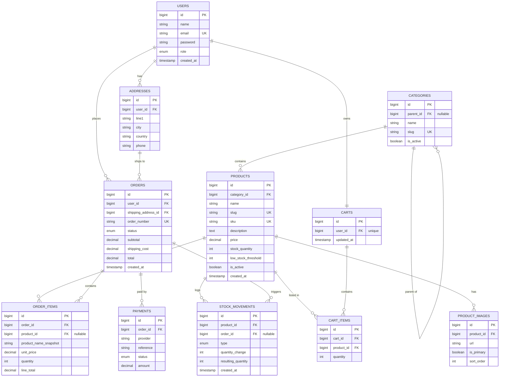

# 03 · Data Model

The system has **11 entities**. This document lists every entity, its fields, the relationships between them (with cardinality, foreign key, and delete behavior), and the indexing/constraint strategy.

- [1. ERD](#1-erd)
- [2. Relationships](#2-relationships)
- [3. Entities](#3-entities)
- [4. Constraints & Indexes](#4-constraints--indexes)
- [5. Design Notes](#5-design-notes)

---

## 1. ERD

---

## 2. Relationships

| From | Cardinality | To | Foreign key | On delete |
|------|:-----------:|----|-------------|-----------|
| users | 1 — N | addresses | `addresses.user_id` | CASCADE |
| users | 1 — 1 | carts | `carts.user_id` (unique) | CASCADE |
| users | 1 — N | orders | `orders.user_id` | RESTRICT |
| addresses | 1 — N | orders | `orders.shipping_address_id` | RESTRICT |
| categories | 1 — N | categories | `categories.parent_id` (nullable) | SET NULL |
| categories | 1 — N | products | `products.category_id` | RESTRICT |
| products | 1 — N | product_images | `product_images.product_id` | CASCADE |
| products | 1 — N | cart_items | `cart_items.product_id` | CASCADE |
| products | 1 — N | order_items | `order_items.product_id` (nullable) | SET NULL |
| products | 1 — N | stock_movements | `stock_movements.product_id` | RESTRICT |
| carts | 1 — N | cart_items | `cart_items.cart_id` | CASCADE |
| orders | 1 — N | order_items | `order_items.order_id` | CASCADE |
| orders | 1 — N | payments | `payments.order_id` | CASCADE |
| orders | 1 — N | stock_movements | `stock_movements.order_id` (nullable) | SET NULL |

**Many-to-many resolved:** `products ↔ carts` via `cart_items`, and `products ↔ orders` via `order_items`. Both pivots carry extra data (quantity, price), so they are modeled as first-class entities, not bare pivot tables.

---

## 3. Entities

### `users`
Customers and admins. `role` is an enum (`customer`, `admin`). Passwords are hashed. Auth tokens are managed by Sanctum in its own table.

### `addresses`
Shipping addresses owned by a user. An order references the address it was shipped to. Deleting a user cascades their addresses, but an address referenced by an order is protected (RESTRICT) to preserve order history.

### `categories`
Self-referencing tree via `parent_id` (nullable → top-level). `slug` is unique for clean URLs. Deactivated with `is_active` rather than deleted.

### `products`
The catalog core. `stock_quantity` is the live available quantity; `low_stock_threshold` drives reorder alerts. `price` is `decimal(12,2)`. `sku` and `slug` are unique. Soft-hidden via `is_active`.

### `product_images`
Multiple images per product, with one `is_primary` and an explicit `sort_order`. Stores URLs (object storage/CDN), not binaries.

### `carts`
Exactly one active cart per user (`user_id` unique → 1:1). Registered users only.

### `cart_items`
Lines in a cart. Unique on `(cart_id, product_id)`. Holds a `quantity`; the authoritative price is resolved at checkout, not stored here.

### `orders`
A placed order. `order_number` is a unique human-facing identifier. `status` is an enum following the lifecycle in [Requirements §5](01-requirements.md#5-business-rules). Totals are stored (`subtotal`, `shipping_cost`, `total`).

### `order_items`
Order lines with **snapshots**: `product_name_snapshot` and `unit_price` are frozen at purchase time. `product_id` is nullable with `SET NULL` so historical orders survive product deletion.

### `payments`
One or more payment attempts per order (`provider`, `reference`, `status`, `amount`). Abstracted from any specific gateway.

### `stock_movements`
Append-only audit log of every quantity change: `type` ∈ (`sale`, `restock`, `adjustment`, `cancel`), the signed `quantity_change`, and the `resulting_quantity` after the change. `order_id` is nullable (manual adjustments have no order).

---

## 4. Constraints & Indexes

| Table | Constraint / Index | Reason |
|-------|--------------------|--------|
| users | UNIQUE(`email`) | Login identity |
| categories | UNIQUE(`slug`), INDEX(`parent_id`) | Lookup & tree traversal |
| products | UNIQUE(`sku`), UNIQUE(`slug`), INDEX(`category_id`), INDEX(`is_active`) | Catalog queries & filtering |
| products | INDEX(`stock_quantity`, `low_stock_threshold`) | Low-stock reporting |
| carts | UNIQUE(`user_id`) | One active cart per user |
| cart_items | UNIQUE(`cart_id`, `product_id`) | No duplicate lines |
| orders | UNIQUE(`order_number`), INDEX(`user_id`, `status`) | Lookup & customer order lists |
| order_items | INDEX(`order_id`), INDEX(`product_id`) | Joins |
| stock_movements | INDEX(`product_id`, `created_at`), INDEX(`order_id`) | Audit queries & reports |
| payments | INDEX(`order_id`), INDEX(`status`) | Reconciliation |

An **idempotency** store (table or Redis) keys `POST /orders` by `Idempotency-Key` + user to guard against duplicate submissions.

---

## 5. Design Notes

- **Money as decimals, never floats.** All money columns are `decimal(12,2)`; the domain wraps them in a `Money` value object (see [Architecture §6.6](02-architecture.md#66-value-object--money)).
- **Snapshots protect history.** Orders never depend on the current state of a product.
- **Audit over mutation.** We never lose the "why" of a stock change — `stock_movements` is the source of truth for inventory history and reporting.
- **Soft deletion by default** for catalog data keeps referential integrity simple and history intact.

---

**Previous:** [← 02 · Architecture](02-architecture.md) · **Next:** [04 · API Reference →](04-api-reference.md)
