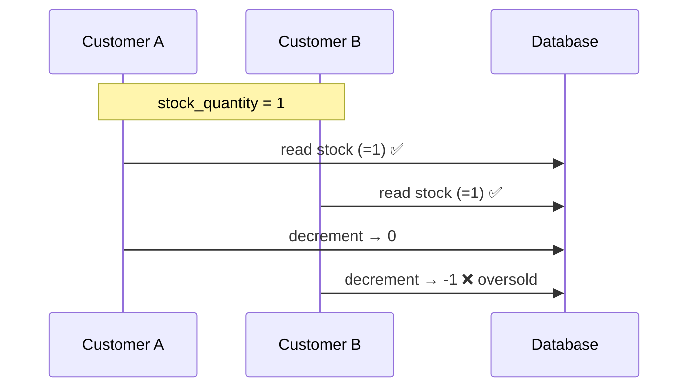

# 05 · Inventory & Concurrency

Inventory correctness is the **hardest and most important** part of this system. This document explains the stock model, the overselling problem, and the exact strategy (with code) we use to guarantee it never happens.

- [1. The Problem](#1-the-problem)
- [2. Stock States](#2-stock-states)
- [3. The Rule](#3-the-rule)
- [4. Overselling Protection — Pessimistic Locking](#4-overselling-protection--pessimistic-locking)
- [5. Cancellation & Restock](#5-cancellation--restock)
- [6. Low-Stock Detection & Alerts](#6-low-stock-detection--alerts)
- [7. The Mandatory Concurrency Test](#7-the-mandatory-concurrency-test)
- [8. Reservation — Deferred](#8-reservation--deferred)

---

## 1. The Problem

Two customers try to buy the **last unit** of a product at the same millisecond. Without protection, both requests read `stock_quantity = 1`, both pass the check, and both decrement — leaving `-1` and two orders for one unit. This is **overselling**, and it is a data-integrity bug, not a rare edge case.



---

## 2. Stock States

| State | Condition | Behavior |
|-------|-----------|----------|
| 🟢 **In stock** | `stock_quantity > low_stock_threshold` | Sellable normally |
| 🟡 **Low / reorder** | `stock_quantity <= low_stock_threshold` | Sellable, but raises a `ProductLowStock` alert to admins |
| 🔴 **Out of stock** | `stock_quantity = 0` | Not sellable; rejected at add-to-cart and checkout |

---

## 3. The Rule

> **Stock is deducted at checkout (order creation), never when an item is added to the cart.**

- **Add to cart** = a soft, non-binding check that the quantity is currently available. No reservation is made.
- **Checkout** = the real deduction, performed inside a database transaction with row-level locking.

This keeps carts cheap and non-blocking while making the single moment that matters — order creation — fully consistent.

---

## 4. Overselling Protection — Pessimistic Locking

At checkout we open a transaction and lock each product row with `SELECT … FOR UPDATE` (`lockForUpdate()` in Eloquent). A concurrent transaction that wants the same row **blocks** until we commit — so only one checkout can evaluate and decrement a given product's stock at a time.

```php
final class InventoryService
{
    public function __construct(private readonly ProductRepositoryInterface $products) {}

    /**
     * Deduct stock for a sale. Must be called inside a DB transaction.
     * @throws InsufficientStockException
     */
    public function deductForSale(int $productId, int $quantity, int $orderId): void
    {
        // SELECT ... FOR UPDATE — locks the row until the surrounding transaction commits.
        $product = $this->products->lockById($productId);

        if ($product->stock_quantity < $quantity) {
            throw new InsufficientStockException($product, $quantity);
        }

        $product->decrement('stock_quantity', $quantity);

        StockMovement::create([
            'product_id'         => $product->id,
            'order_id'           => $orderId,
            'type'               => StockMovementType::Sale,
            'quantity_change'    => -$quantity,
            'resulting_quantity' => $product->stock_quantity,
        ]);

        if ($product->stock_quantity <= $product->low_stock_threshold) {
            event(new ProductLowStock($product->id));
        }
    }
}
```

The `CheckoutService` (see [Architecture §6.3](02-architecture.md#63-service--checkoutservice-the-core)) wraps a loop over cart items in `DB::transaction(...)`, calling `deductForSale` for each. If any line throws, the **entire transaction rolls back** — no partial orders, no partial deductions.

### Why pessimistic (not optimistic) locking?
Checkout is a short, high-contention critical section on a single row. Pessimistic locking is simple, correct, and fast enough here. An optimistic approach (version column + retry) is viable but adds retry complexity for no practical gain at expected volumes.

### Guardrails
- Keep the locked transaction **short** — no external/API calls (e.g., payment capture) inside it.
- Always lock in a **consistent order** (e.g., by ascending `product_id`) to avoid deadlocks when an order has many items.
- Use `RESTRICT` on `stock_movements.product_id` so audit history can't be silently lost.

---

## 5. Cancellation & Restock

Cancelling a not-yet-shipped order returns quantities to stock and records the reversal — again inside a transaction.

```php
public function restockForCancellation(Order $order): void
{
    DB::transaction(function () use ($order) {
        foreach ($order->items as $item) {
            if ($item->product_id === null) {
                continue; // product was deleted; snapshot remains for history
            }
            $product = $this->products->lockById($item->product_id);
            $product->increment('stock_quantity', $item->quantity);

            StockMovement::create([
                'product_id'         => $product->id,
                'order_id'           => $order->id,
                'type'               => StockMovementType::Cancel,
                'quantity_change'    => +$item->quantity,
                'resulting_quantity' => $product->stock_quantity,
            ]);
        }
        $order->update(['status' => OrderStatus::Cancelled]);
    });
}
```

---

## 6. Low-Stock Detection & Alerts

When a deduction brings a product to or below its threshold, `deductForSale` fires `ProductLowStock`. A **queued** listener notifies admins, so the checkout request is never slowed by sending notifications.

- Admin report endpoint: `GET /api/v1/admin/products/low-stock`.
- Query: `WHERE stock_quantity <= low_stock_threshold` (backed by an index — see [Data Model §4](03-data-model.md#4-constraints--indexes)).

---

## 7. The Mandatory Concurrency Test

This test is the proof that overselling cannot happen. It must exist and pass.

```php
final class OverseldingTest extends TestCase
{
    use RefreshDatabase;

    public function test_never_oversells_the_last_unit_under_concurrency(): void
    {
        $product = Product::factory()->create(['stock_quantity' => 1]);

        // Two customers, each with a cart holding 1 of the same product.
        [$a, $b] = [$this->customerWithCartItem($product, 1), $this->customerWithCartItem($product, 1)];

        // Fire both checkouts as concurrently as the harness allows (parallel connections).
        $results = $this->runConcurrently([
            fn () => $this->attemptCheckout($a),
            fn () => $this->attemptCheckout($b),
        ]);

        $this->assertSame(1, collect($results)->where('status', 201)->count()); // one succeeds
        $this->assertSame(1, collect($results)->where('status', 422)->count()); // one rejected
        $this->assertSame(0, $product->fresh()->stock_quantity);                // never negative
        $this->assertSame(1, Order::count());
    }
}
```

> In CI, true parallelism can be approximated with parallel processes/DB connections. The invariants asserted — one success, one rejection, non-negative stock — are what matter.

---

## 8. Reservation — Deferred

A timed **reservation** model (hold stock for N minutes during checkout, release on expiry via a scheduled job or Redis TTL) is intentionally **out of scope for v1**. Pessimistic locking at checkout is sufficient for the expected load. If a single product ever sees extreme concurrent demand (flash sales), reservation can be added later without changing the public API — only the inventory internals.

---

**Previous:** [← 04 · API Reference](04-api-reference.md) · **Next:** [06 · Implementation Plan →](06-implementation-plan.md)
