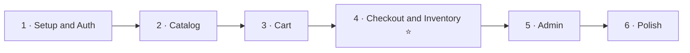

# 06 · Implementation Plan

The build order, deliverables per milestone, and the definition of done. Each milestone is independently demonstrable to the client.

- [1. Milestones](#1-milestones)
- [2. Definition of Done](#2-definition-of-done)
- [3. Cross-cutting Concerns](#3-cross-cutting-concerns)
- [4. Suggested Sprint Breakdown](#4-suggested-sprint-breakdown)

---

## 1. Milestones

### Milestone 1 — Setup & Auth
- Laravel project, coding standards (Pint), CI pipeline, base error handling.
- Sanctum; `register`, `login`, `logout`, `me`.
- `users` + roles; base Policy/Gate wiring.
- **Deliverable:** a customer can register, log in, and call an authenticated endpoint.

### Milestone 2 — Catalog
- `categories` (hierarchical) & `products` (+ `product_images`) migrations, models, factories, seeders.
- Public listing with pagination, search, filtering, sorting; product detail.
- Admin CRUD for categories & products.
- **Deliverable:** browse and manage the catalog end-to-end.

### Milestone 3 — Cart
- `carts` + `cart_items`; one active cart per user.
- Add / update / remove / clear with soft stock checks.
- **Deliverable:** a customer can build a cart that reflects availability.

### Milestone 4 — Checkout & Inventory ⭐ (the core)
- `orders`, `order_items`, `stock_movements`.
- `CheckoutService` + `InventoryService`: transactional deduction with `lockForUpdate`, price snapshots, idempotency.
- Order listing, detail, cancellation (restock).
- **The mandatory [concurrency test](05-inventory-and-concurrency.md#7-the-mandatory-concurrency-test).**
- **Deliverable:** cart → order with guaranteed no overselling.

### Milestone 5 — Admin
- Admin order-status transitions.
- Low-stock report & manual restock/adjustment.
- **Deliverable:** operators can run the store.

### Milestone 6 — Polish
- `payments` + a payment provider interface (stub gateway).
- Domain events on the queue (order confirmation email, low-stock alerts).
- OpenAPI/Swagger docs; rate limiting tuned; caching on catalog reads.
- **Deliverable:** production-readiness pass.

---

## 2. Definition of Done

A feature is "done" only when **all** of the following hold:

- [ ] Endpoints validated via Form Requests; authorized via Policies.
- [ ] Business logic lives in a Service/Action, not the controller.
- [ ] Responses shaped by API Resources; errors use the standard envelope.
- [ ] Feature tests cover happy path + key failure paths.
- [ ] Migrations reversible; factories & seeders present.
- [ ] Money handled via `Money`; no floats.
- [ ] No N+1 queries on list endpoints (eager loading verified).
- [ ] Documented in the OpenAPI spec.

---

## 3. Cross-cutting Concerns

| Concern | Approach |
|---------|----------|
| **Validation** | Form Requests per endpoint |
| **Authorization** | Policies + `can:` middleware |
| **Errors** | Central handler → consistent JSON envelope + correct status |
| **Money** | `decimal(12,2)` + `Money` value object |
| **Concurrency** | `DB::transaction` + `lockForUpdate` at checkout & restock |
| **Idempotency** | `Idempotency-Key` on `POST /orders` |
| **Async work** | Redis queue for emails, alerts, low-stock checks |
| **Rate limiting** | `throttle` middleware, stricter on auth & checkout |
| **Caching** | Cache catalog reads; bust on product/category writes |
| **Observability** | Structured logs + `stock_movements` audit trail |
| **Security** | HTTPS, hashed passwords, mass-assignment protection, token scoping |

---

## 4. Suggested Sprint Breakdown

| Sprint | Focus | Milestones |
|--------|-------|-----------|
| 1 | Foundation & accounts | M1 |
| 2 | Catalog | M2 |
| 3 | Cart + start checkout | M3, begin M4 |
| 4 | Checkout, inventory, concurrency test | finish M4 |
| 5 | Admin tooling | M5 |
| 6 | Payments, events, docs, hardening | M6 |

> Milestone 4 is the risk center of the project. Schedule it when the team has the most focus, and do not compress its testing.

---

**Previous:** [← 05 · Inventory & Concurrency](05-inventory-and-concurrency.md) · **Back to:** [README](../README.md)
