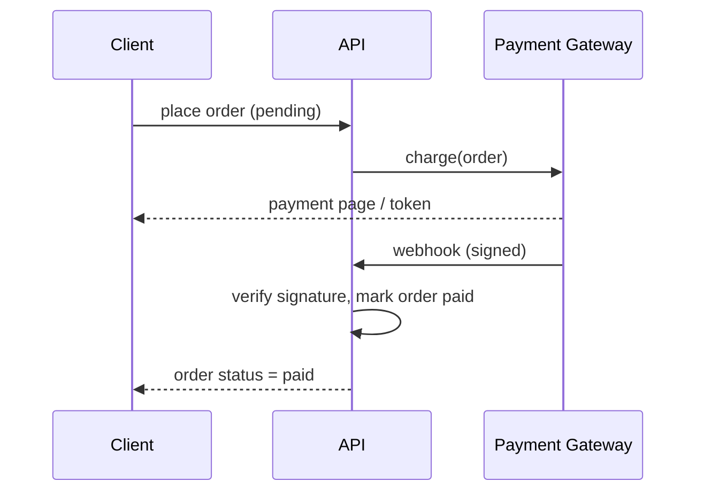

# 09 · Integrations & Third Parties

External services the system talks to, and the pattern we use to keep them replaceable. All third-party calls live behind a service in `App\Services\ThirdParties\{Vendor}\` and are configured via `config/*.php` + environment variables — never hard-coded.

- [1. Integration Principles](#1-integration-principles)
- [2. Payment Gateway](#2-payment-gateway)
- [3. Media & Storage](#3-media--storage)
- [4. Push Notifications](#4-push-notifications-optional)
- [5. API Documentation](#5-api-documentation)
- [6. Configuration & Secrets](#6-configuration--secrets)

---

## 1. Integration Principles

- **Behind an interface.** Each vendor is wrapped by a service implementing a local contract, so the vendor can be swapped without touching order/business logic.
- **Config, not code.** Keys and endpoints come from `config/{vendor}.php`, which reads `env()`. Secrets never appear in the repo.
- **Webhooks are verified.** Any inbound webhook validates a signature/HMAC before acting.
- **Idempotent side effects.** Payment callbacks and webhooks are safe to receive more than once.

---

## 2. Payment Gateway

The `payments` table records attempts; the gateway itself is abstracted.

```php
namespace App\Services\ThirdParties\Payment;

interface PaymentGatewayInterface
{
    public function charge(\App\Models\Order $order): PaymentResult;   // initiate a charge
    public function verifyWebhook(\Illuminate\Http\Request $request): bool;
}
```

- **Implementation:** e.g. `App\Services\ThirdParties\Paymob\PaymobGateway implements PaymentGatewayInterface`, bound in a service provider.
- **Flow:** order created (`pending`) → `charge()` → gateway redirect/token → webhook confirms → order marked `paid`, a `payments` row set to `succeeded`.
- **Rule:** the payment call happens **outside** the stock-locking transaction (see [05 · Inventory & Concurrency](05-inventory-and-concurrency.md#guardrails)).



---

## 3. Media & Storage

- **Spatie Media Library** manages product images as media collections on the `Product` model.
- **Storage disk:** S3 (League Flysystem AWS S3) in production; `local`/`public` in development. Controlled by `FILESYSTEM_DISK`.
- **API exposes URLs**, not binaries — `product_images.url` points at the stored/CDN asset.
- **Uploads** are handled through Filament (admin) and/or a dedicated authenticated upload endpoint.

---

## 4. Push Notifications (optional)

- **Channel:** `laravel-notification-channels/fcm` (Firebase Cloud Messaging).
- **Use cases:** order status changes (`shipped`, `delivered`), and could extend to back-in-stock alerts.
- **Delivery:** always dispatched via **queued** notifications so requests stay fast.
- Device tokens are stored per user (e.g. `notification_token`) and refreshed on login.

---

## 5. API Documentation

- **L5-Swagger** generates OpenAPI 3.0 from PHP 8 attributes/annotations on controllers.
- **Served at:** `/api/documentation`.
- **Kept current:** annotating endpoints is part of the [feature checklist](08-conventions-and-scaffolding.md#5-new-feature-checklist).

---

## 6. Configuration & Secrets

| Concern | Env variable(s) |
|---------|-----------------|
| Payment gateway | `PAYMENT_API_KEY`, `PAYMENT_HMAC`, `PAYMENT_BASE_URL` |
| Storage | `FILESYSTEM_DISK`, `AWS_ACCESS_KEY_ID`, `AWS_SECRET_ACCESS_KEY`, `AWS_BUCKET` |
| Push (FCM) | `FCM_SERVER_KEY` / service-account credentials |
| Currency | `DEFAULT_CURRENCY` |

- `.env` is **git-ignored**; `.env.example` documents required keys with safe placeholders.
- Config files: `config/payment.php`, `config/filesystems.php`, `config/route-attributes.php`, `config/l5-swagger.php`.

---

**Previous:** [← 08 · Conventions & Scaffolding](08-conventions-and-scaffolding.md) · **Back to:** [README](../README.md)
